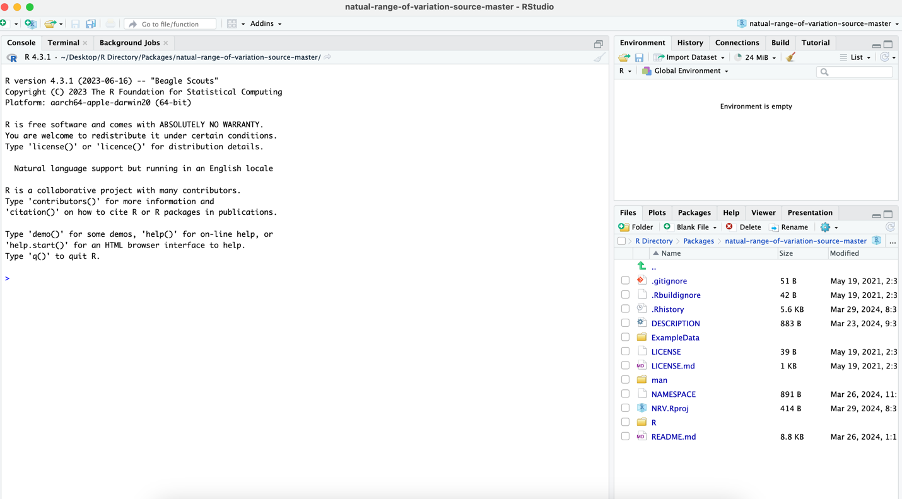
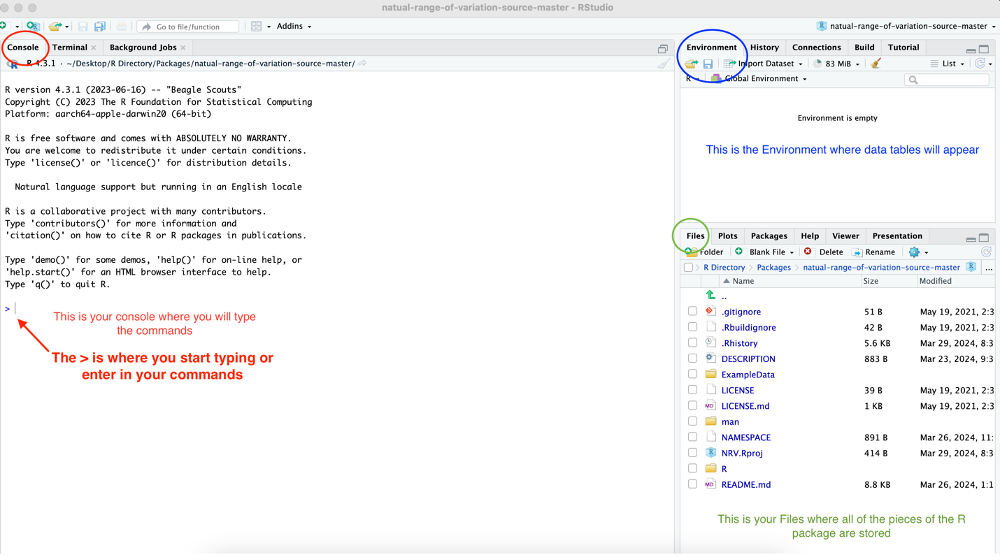
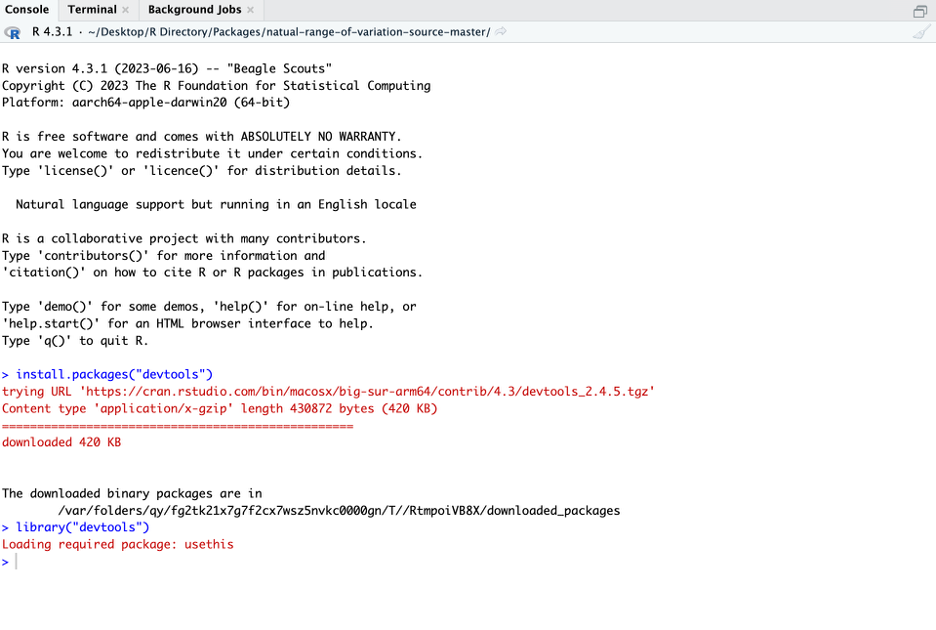
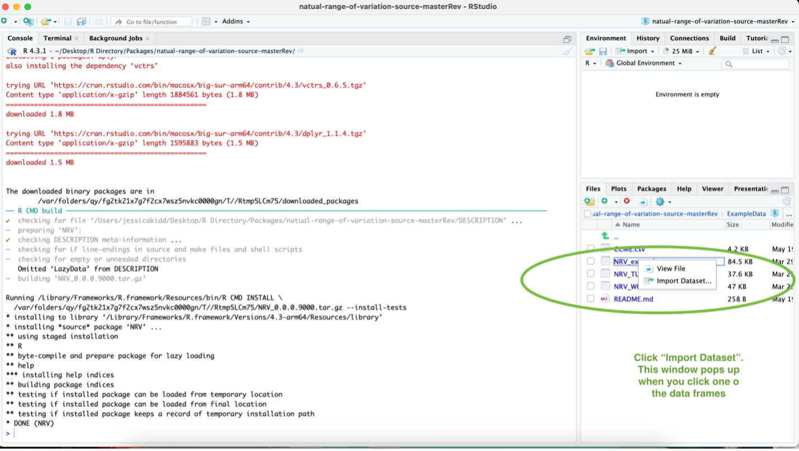
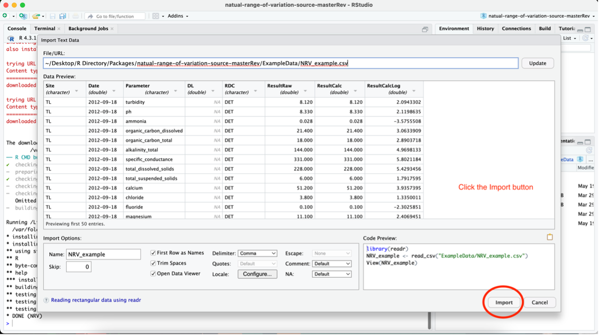
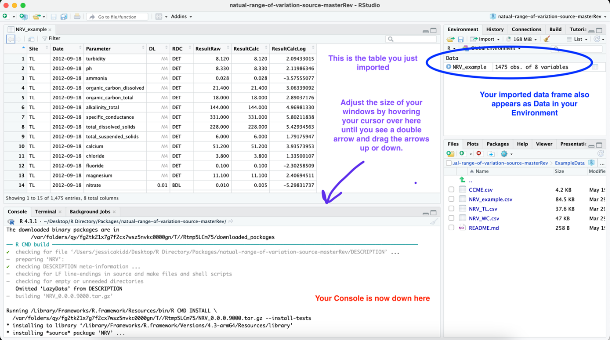
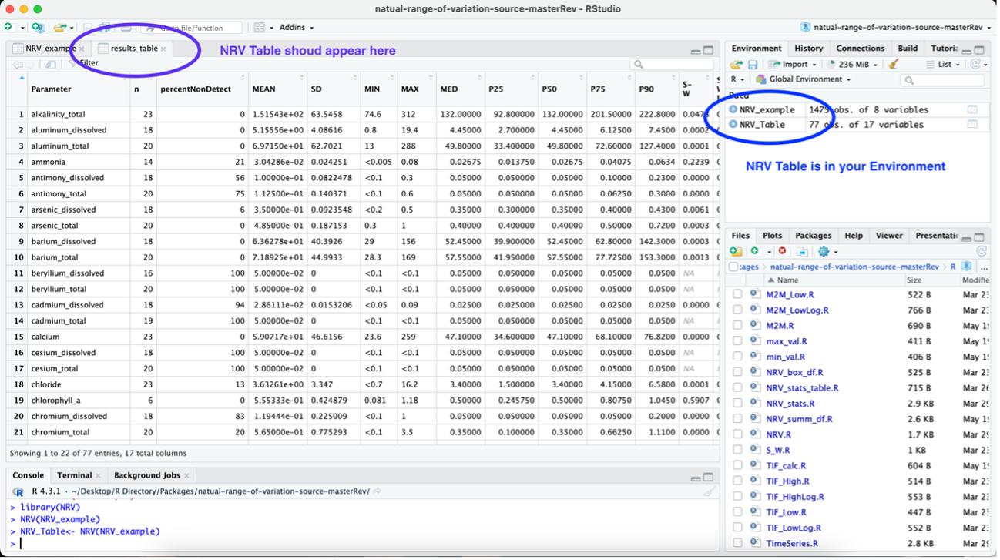
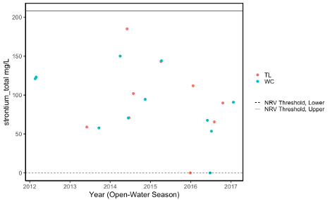
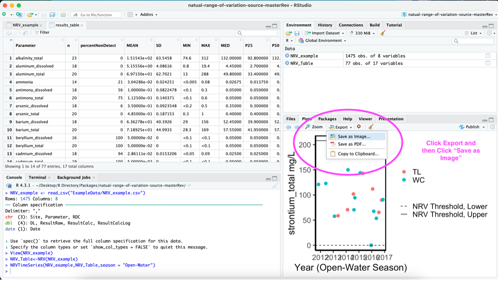
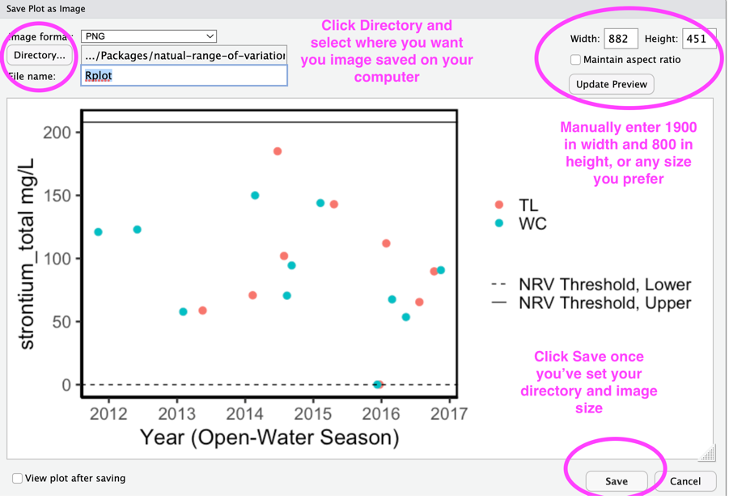

# ChangeLog

**August 6, 2025**

- New version: 0.0.1.0000
- Changed the NRV, NRV_stats, and NRV_stats_table functions so that data_type no longer needs to be set by the user. The table now displays both TIF and M2MAD thresholds, allowing users to select the appropriate method based on their study objectives. The table also has a new column that identifies if the data were untransformed or log-transformed for the NRV calculations.
- Revised the TimeSeries function to allow the user to select TIF or M2MAD thresholds to be displayed on the plot.
- Changed the M2M calculations to be set with constant = 1, to override default correction coefficient 
- Cleaned up TIF and M2M calculation function code to be consistent
- Removed the WORD document Guidance Manual and combined it with the README file (this is now the guidance manual)
- Revised the guidance manual to no longer include the rule that when the percentage of non-detect values is 25-49%, use the M2MAD method. Instead, practitioners are guided to simply select the TIF method when they have known reference sites, and the more conservative M2MAD method when impacted sites may be in their dataset. The choice between the TIF and M2MAD remains at the discretion of the user. 
- Added a globals.R file to identify column names used in the functions to remove warnings from R. 

# About this README file

This README file includes all the information people need to use the NRV R Package. The NRV R Package includes the core NRV function that calculates the Natural Range of Variation (NRV) lower and upper thresholds for surface water quality data. 

# About The NRV Project

The goal of the NRV package is to help government personnel and consultants calculate baseline values for water quality parameters using the Natural Range of Variation (NRV) method developed by the Northwest Territories Cumulative Impact Monitoring Program (NWT CIMP). This NRV method calculates the lower and upper thresholds for individual water quality parameters using either the Tukey Inner Fence (TIF) or the Median±2MAD methods for parameters with <50% results below the detection limit. 

The NRV package provides the NRV function that calculates the NRV thresholds for data frames that contain surface water quality results for one or more sites. It is important to note that the analysis will run for each unique parameter label (i.e., all sites within a dataset are pooled for NRV analysis). Users must remove any site from the dataset that is not meant to be included in the NRV calculation. 

The NRV function produces a table of the NRV thresholds (both TIF and M2MAD upper and lower thresholds) and associated summary statistics. The NRV function requires the user to format their data frame with specific column names. Please refer to the **Data Preparation** section below and the example data frames included with the R Package to see how to format your data frame. The NRV Package also includes a NRVTimeSeries function that produces time series plots that display the NRV thresholds calculated by the NRV function. *Note*: The NRV function must be run before the time series function so that the required data tables with the NRV thresholds are available. 

The R package contains an example data frame you can use to test the package functions by following steps in **Using the NRV Package in R Studio** section below.

# Data Preparation

## Data Source
The dataset you prepare for the NRV calculation should ONLY include the data you plan to calculate the NRV thresholds with. It is important to identify whether all data are from reference sites (i.e., unimpacted) or if some are from potentially impacted sites. 

Ideally, the dataset used to calculate the NRV will contain only reference site data that represent unimpacted conditions at the sites being assessed. 

We recommend selecting the TIF thresholds when calculating the NRV using datasets that only contain known reference site data. Alternatively, we recommend selecting the more conservative M2MAD thresholds when reference sites are unknown and thus your dataset may contain data from impacted sites.

It is possible that reference site data will exceed the NRV thresholds if there are outliers in the dataset (not necessarily errors, but values that do not represent "normal values") or if water quality among the the reference sites is highly variable. In these instances, users may choose to re-run the NRV calculation using only data from the reference site(s) with the highest parameter concentrations to avoid mistakenly identified assessed sites as impacted when they have similar concentrations as certain reference sites. 

## Data Preparation
The following are important steps to perform to prepare your data for the NRV threshold calculation:

- Separate data into appropriate  seasonal datasets (e.g., under-ice, open-water) 

- Average all duplicate samples.

- Remove any censored value (i.e., value below the laboratory minimum detection limit) with a detection limit greater than any measured value (i.e., value above the laboratory minimum detection limit). 

- All detection limits that were less than all measured values should be standardized to the same detection limit. We recommend using the lowest detection limit because this technique is least likely to introduce errors into your dataset. For example, if you have two censored values with detection limits of 0.1 and 0.2, then the detection limit would be standardized to 0.1. The substitution method of one-half the detection would yield values of 0.05 for both samples. It is possible that both samples were 0.05. However, if we instead standardize the detection limits to the highest detection limit, then the substitution method would yield values of 0.1 for both samples. We know at least one of these results is an error because we know the one sample was <0.1.

## Data Frame Formatting
A critical step before using the NRV R Package is to ensure your data frame includes all required columns. The required columns must be labelled as they are here for the function to identify each column required for the NRV threshold calculations. There are **eight** required columns, which are discussed in detail below.

1. **Site**: The “Site” column contains the site ID for where the sample was collected from. 

2. **Date**: The “Date” column contains the data when the sample was collected. The dates will be presented in the YYYY-MM-DD format (e.g., 2024-03-25). 

3. **Parameter**: The “Parameter” column will contain the name of the parameter that was analyzed. Ensure all parameter names are spelled exactly the same throughout your dataset. The NRV thresholds will be calculated for each unique parameter name. If you are calculating the NRV thresholds for both total and dissolved fractions, we recommend distinguishing them by adding the fraction to the parameter name (e.g., arsenic_total, phosphorus_dissolved). It may also be useful to label the parameters with their units of measurement (e.g., mercury_total_ug_L and mercury_total_ng_L). Remember, the names should NOT contain spaces, only underscores “_”.

4. **ResultRaw**: The “ResultRaw” column contains either the raw value for the laboratory results that were above the detection limit *OR* the value of the detection limit for all results below the detection limit. This column should only contain numerical values and not any units of measurement. 

5. **ResultCalc**: The “ResultCalc” column contains the data on which the summary statistics and NRV calculations will be performed. It must contain the raw values for all results above the detection limit AND the value you choose to represent the results below the detection limit (e.g., half the detection limit). This column should only contain numerical values and not any units of measurement. 

6. **ResultCalcLog**: The “ResultCalcLog” column contains the data on which the summary statistics and NRV calculations will be performed if the Shapiro-Wilk test results indicate log-transformation is necessary. This column must contain the log-transformed values of the ResultCalc column. The transformation MUST be completed using the natural logarithm. To achieve this in R, use the function log(). This column should only contain numerical values and not any units of measurement. 

7. **DL**: The “DL” column contains the laboratory minimum detection limit value. If no detection limit value is available, then this column will be NA. This column should only contain numerical values and not any units of measurement.   

8. **RDC**: The “RDC” column (Result Detection Condition) identifies if the result is below the detection limit. In this column, each row should be either “DET” (i.e., detected) for all results that were above the laboratory minimum detection limit OR “BDL” (below detection limit) for all samples that were below the laboratory minimum detection limit. 

# Instructions for Using the NRV Package in R Studio

## Install NRV R Package in R Studio
1. Open your R Studio and click File – New Project – Existing Directory
Navigate to the folder that contains the R package files (it should be labelled natural-range-of-variation). If you have downloaded the R package as a zip.folder, make sure you have saved it as an uncompressed folder on your computer. 

2. Your R Workspace should look similar to the image below with all of the R package files listed in the bottom right Files window. 

 

The figure below highlights 3 key areas of your R studio workspace, the **Console**, **Environment**, and **Files**.

 

3.	You need to install and load the development tool kit. You can skip the installation step if you’ve already installed devtools. *Note*: If this is your first time downloading the devtools package then it may take several minutes and expect to see a lot of text appearing in your **Console**. You will know the download is complete when the blue arrow appears at the bottom of your **Console**. In the **Console** (where the “>” symbol is), type the following (or copy/paste) and then hit the enter key:
 
install.packages("devtools")

library("devtools")

 

 
 

4.	Now you need to install and load the NRV package. *Note*: When you install the R package, you may receive a message that lists all of the recent updates to packages used within the NRV package. Simply enter the number of updates it lists to continue. In the **Console**, type the following:

install()

Now, load the NRV Package by typing the following in the **Console**:

library(NRV)

 

## Create NRV Table

The NRV function generates an NRV Table that includes the following for each unique parameter in your data frame: summary statistics, the percent of samples with results below the detection limit, the p-values of the Shapiro-Wilk test performed on untransformed and log-transformed data, the NRV method selected, and the upper and lower NRV thresholds. 

1.	Import your data frame into R Studio. *Note*: your data frame MUST be formatted exactly as outlined in the **Data Frame Formatting**  section or the NRV functions will not work.  

Here, we will guide you on using one of the example data frames that comes with the NRV Package. To use your own data frame, simple replace the name of the example data frame with the name of yours as it appears in your **Environment**. 

To access the example data, click the “inst” file in **Files**, then click "ExampleData", then click “NRV_example” and click “ImportDatset…”. When the Import Text Data window appears just click “Import” in the bottom right corner. See sample images below.

 

 

 

The example data frame NRV_example should now appear in your **Environment** and a new window will appear in the top left corner of your R Workspace displaying the contents of your data frame. You can adjust the size of your **Console** that is now in the bottom left corner of your R workspace where you will continue to type your commands. See example image below.

 

 

2. Use the NRV function to create the NRV Table.

Type the following in the **Console** to create the NRV Table:

NRV(NRV_example)

The results_table (i.e., NRV Table) will appear in your R Workspace. 

Below are the details of the NRV Summary Table output:

- **Parameter**: name of parameter the calculations were performed on.

- **n**: the total number of samples used to perform the calculations.

- **percentNonDetect**: the percentage of samples with results below the laboratory minimum detection limit (i.e., “BDL” in the RDC column of your data frame). 

- **MEAN**: The mean value of the parameter’s CalcResult values.

- **MIN**: The minimum value of the parameter’s CalcResult values.

- **MAX**: The maximum value of the parameter’s CalcResult values.

- **SD**: The standard deviation of the parameter’s CalcResult values.

- **P25**: 25th percentile (i.e., 1st Quartile) of the parameter’s CalcResult values.

- **P50**: 50th percentile of the parameter’s CalcResult values.

- **P75**: 75th percentile (i.e., 3rd Quartile) of the parameter’s CalcResult values.

- **P90**: 90th percentile of the parameter’s CalcResult values.

- **S-W**: The p-value of the Shapiro-Wilk test performed on the parameter’s CalcResult	values.

- **S-WLog**: The p-value of the Shapiro-Wilk test performed on the parameter’s CalcResultLog values.

- **logTransformed**: YES if data were log-transformed and NO if data were not log-transformed for the NRV calculations.

- **TIF_lowerThreshold**: The lower NRV threshold calculated using the TIF method. 

- **TIF_upperThreshold**: The upper NRV threshold calculated using the TIF method. 

- **M2MAD_lowerThreshold**: The lower NRV threshold calculated using the M2MAD method. 

- **M2MAD_upperThreshold**: The lower NRV threshold calculated using the M2MAD method. 

 

3. Save the NRV output as a table.

Type the following function to also save it as a data frame in your **Environment**:

NRV_Table<- NRV(NRV_example)

 

The NRV Table is now saved in your Environment as NRV_Table. See example image below.

 

 

4. Export the table. 

You can now export this table to your computer as a .csv file by typing the following in the console:

write.csv(NRV_Table, "NRV_Table.csv", row.names = TRUE)

This code will export the .csv file to your R Working Directory. To see where your R Working Directory is on your computer, type the following:

getwd()

 

## Create NRV Time Series Plots
The NRV Package contains the function NRVTimeSeries that will automatically create time series plots for all parameters that display the lower and upper NRV thresholds. 

To create time series plots of all the parameters that have calculated NRV thresholds, you must enter the following information into the function: 

**1.** The name of your data frame that contains the data you want displayed on the time series plot. In this example, this data frame is NRV_example.

**2.**	The name you have assigned the results_table from the NRV function. In this example, this table is NRV_table.

**3.**	The season the data were collected in. In this example, the season is Open-Water

**4.**	The NRV calculation method you have selected for your study (“TIF” or “M2MAD”)

To run the function, type the following:

NRVTimeSeries(NRV_example, NRV_Table, season = "Open-Water", NRVmethod = “TIF”)

Below is an example of what the time series plots will look like. TL and WC are the site names from the data frame.

 

 

The plots will all appear automatically in the bottom right-hand corner of you R Workspace under the **Plots** tab.

 

 

Once you select Save as Image a new window “Save Plot as Image” will appear with options to select where the image is saved on your computer and to adjust the size of the image. Adjusting the image size is important to ensure the resolution is suitable for a report. Typically, a width of 1900 and heigh of 800 is sufficient. 

 

 

END
